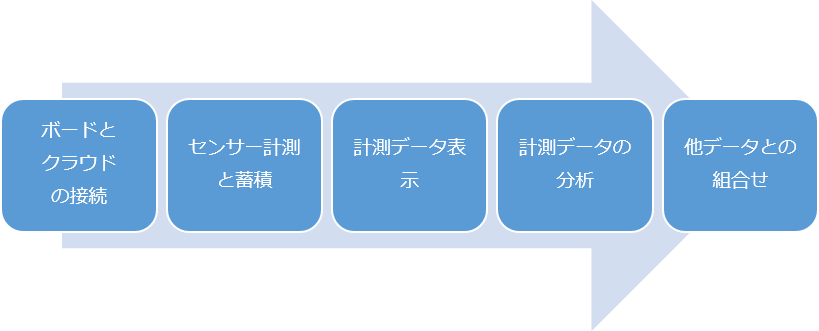

## 学習内容と学習方法
IoT Kitハンズオントレーニングは、MVA（Microsoft Virtual Academy）によるオンライントレーニングを通じて、または、マイクロソフトや各種団体が実施するハンズオンセミナーによる集合形式のセミナー等で、学習します。

トレーニングは、IoTを実現するのに必要な要素毎に、ステップバイステップで実施していきます。

 
<a class="btn btn-default" href="index.htm" role="button">Return to homepage</a>
