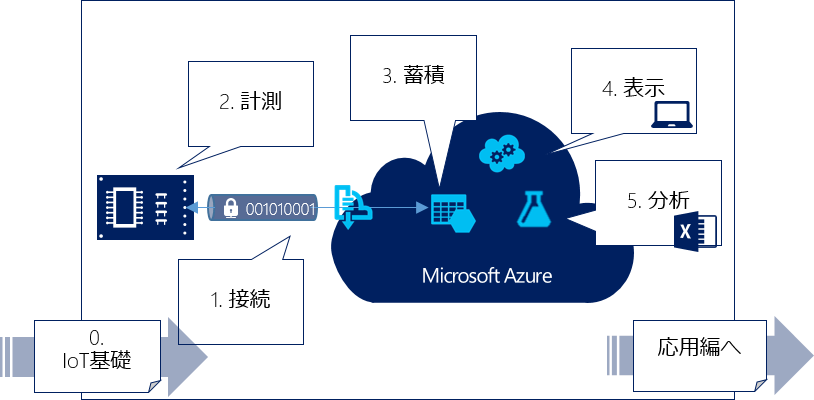

## 学習内容と学習方法

トレーニングは、IoTを実現するのに必要な要素毎に、ステップバイステップで学習していきます。

IoT Kitハンズオントレーニングは、MVA（Microsoft Virtual Academy）によるオンライントレーニングを通じての自学習、または、マイクロソフトや各種団体が実施するハンズオンセミナーによる集合形式のセミナー等での受講が可能です。

### このハンズオンで学べる技術一覧

* Windows 10 IoT Core　- 予定
* .NET Micro Framework
* Visual Studio
* Azure Web Sites
* Azure Web Job
* Azure Event Hub
* Azure Storage
* Azure SQL
* Azure Mobile Servive
* Windows Store Apps
* Excel Power BI
* Azure Stream Analytics
* Azure Machine Learning
* Azure Virtual Machine
* Azure IoT Hub - 予定
* AllJoyn - 予定

## セミナー、イベント一覧

* 2015/10/23　IoT Kitハンズオンセミナー＠沖縄 
* 2015/10/19　IoT Kitハンズオンセミナー＠福岡 
* 2015/10/12　IoT Kitハンズオンセミナー＠札幌 
* 2015/10/6　 IoT Kitハンズオンセミナー＠名古屋 
* 2015/9/28　 IoT Kitハンズオンセミナー＠大阪
* 2015/9/25  [IoTデータを活用してみよう」＠奈良](http://www.pref.nara.jp/item/144988.htm#moduleid60194) - 募集中
* 2015/9/16  [IoT Kitハンズオンセミナー＠品川](https://msevents.microsoft.com/CUI/EventDetail.aspx?EventID=1032655578&Culture=ja-JP&community=0)  - 募集中
* 2015/9/15  [IoT Kitハンズオンセミナー＠品川](https://msevents.microsoft.com/CUI/EventDetail.aspx?EventID=1032655577&Culture=ja-JP&community=0) - 募集中
* 2015/8/4   [Microsoftのテクノロジーで実現する‼ Internet of Things@品川](https://msevents.microsoft.com/CUI/EventDetail.aspx?EventID=1032643458&Culture=ja-JP&community=0) - 終了
* 2015/6/16  [IoT Kitハンズオンセミナー@青森](https://sites.google.com/site/aomoriiot/H27/1) - 終了
* 2015/6/14  [IoT Kitハンズオンセミナー@札幌](http://iot-algyan-do.connpass.com/event/15188/) - 終了
* 2015/6/10  IoT Kitハンズオンセミナー @香川
* 2015/6/6   IoT Kitハンズオンセミナー @名古屋
* 2015/6/1-5　[Raspberry PI2でWindows for IoTを体験 @秋葉原](http://windows10.connpass.com/)　- 終了。参加された皆さん、お疲れ様でした‼
* 2015/5/9   IoT Kitハンズオンセミナー―マイコンとクラウドとの連携を体験する― @長岡　- 終了
* 2015/4/25  [ふくあず 春のIoT祭り　～IoT ハンズオンとAzureとわたし～ 【JAZUG福岡支部】@福岡](https://jazug.doorkeeper.jp/events/22353) - 終了
* 2015/4/23  [IoT(InternetofThings) Kitハンズオンセミナー＠松江](https://itradar.doorkeeper.jp/events/22529) - 終了
* 2015/4/22  [IoT Kitハンズオンセミナー＠広島](https://msevents.microsoft.com/CUI/EventDetail.aspx?EventID=1032622021&Culture=ja-JP&community=0) - 終了
* 2015/3/16  [IoT(InternetofThings) Kitハンズオンセミナー＠山形](https://docs.google.com/forms/d/111ttZFk1_9cXz7aP9yRC6ItqsJ9K-EjJifq8XnScjPA/viewform?c=0&w=1) - 終了
* 2015/3/9  [IoT(InternetofThings) KitHandsonトレーニング＠なごや](http://partake.in/events/a7d9efc3-c5bc-4d2a-b447-4674ce5cd4f6) - 終了
* 2015/2/28 [IoT（モノのインターネット）体験講習会 大阪](http://eccsmartapp.doorkeeper.jp/events/20724)　- 終了
* 2015/2/19-20 [Developer Summit 2015 19-B-4](http://event.shoeisha.jp/devsumi/20150219/timetable) - セミナー（満席御礼） セミナー来ていただいた皆さん、ありがとう。ハンズオン参加されたみなさんお疲れ様でした
* 2015/2/6 [IoT（モノのインターネット）体験講習会 奈良](http://www.pref.nara.jp/item/133489.htm) - 好評のうちに終了
* 2015/1/30-31 [沖縄IT津梁祭り](http://www.it-matsuri.net/index.html) IoT Kit展示 タッチ＆トライ - 来場された皆様ありがとうございました‼
* 2015/1/26 [Azure Camp IoT Kit ハンズオントレーニングセミナー](https://msevents.microsoft.com/CUI/EventDetail.aspx?EventID=1032609294&Culture=ja-JP&community=0) - 終了しました
* 2015/1/22-23 [ファームウェア活用研修 仙台」](http://www.mit.pref.miyagi.jp/embedded/kensyu_26/#firmware) - 終了しました
* 2015/1/16 [Go Azure 渋谷](http://r.jazug.jp/) - おばかIoTシンポジウム御礼
* 2014/12/21 [Android Bazaar and Conference 2014](http://abc.android-group.jp/2014w/) - セミナー＆展示
* 2014/12/15-19 [IoTソリューション開発セミナー](http://www.microsoft.com/ja-jp/mic/seminar/iot_ml.aspx) - 大好評のうちに終了　
* 2014/11/23-24 MAKER FAIR Tokyo IoT Kit 展示　－　終了しました
* 2014/11/19-21 ET2014 マイクロソフトブース IoT Kit 展示 ー 終了しました

 
<a class="btn btn-default" href="index.htm" role="button">Return to homepage</a>
